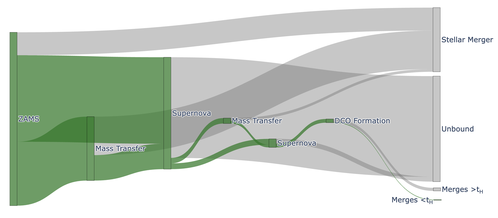

# bseflow: A visualization tool for BPS

**A visualization tool for binary stellar evolution population synthesis simulations.**

`bseflow` is a Python package that traces the formation pathways of gravitational-wave sources -- binary black holes (BBH), binary neutron stars (BNS), and black hole-neutron stars (BHNS) merger -- through their intermediate evolutionary stages, and generates an interactive Sankey diagram.

With a raw [`COMPAS`](https://compas.science) HDF5 output of a binary population synthesis run, `bseflow` tracks the intermediate evolutionary stages of all binary systems, generates a table with fractions of the population undergoing each sequence of stages, and turns the table into a Sankey flow diagram showing the fraction of binaries that survive or are lost at each binary evolution stage (e.g. mass transfer, common-envelope episodes, supernovae, etc). 

---

## Installation

```bash
pip install bseflow
```

Or from source for development:

```bash
git clone https://github.com/ana-lam/bseflow.git
cd bseflow
pip install -e .
```

Requires Python ≥ 3.9. `numpy`, `pandas`, `scipy`, `numba`, `h5py`, `plotly`, `matplotlib`, `tqdm`, `pyyaml` install automatically with the package.

---

## Quickstart

### 1. Generate a config file

Since this tool was originally developed with a older `COMPAS` version output, `bseflow` reads a `bseflow.yaml` from your working directory with default configs + mapping of `COMPAS` output headers.

Create the default template with:
```bash
bseflow
```

### 2. Read a `COMPAS` output and calculate intermediate-stage rates

Read the output HDF5 file and write a small CSV with the rates of intermediate stages.

```bash
python -m bseflow.output_rates /path/to/COMPAS_Output.h5 --save_path myrun
```

or from Python:

```python
from bseflow.output_rates import output_results

output_results("/path/to/COMPAS_Output.h5", save_path="myrun")
```

This writes a `rates_*.csv` into the configured `rates_dir` (default: `rates_output/`).

Useful options:

| Flag / argument          | Description                                                    |
| ------------------------ | ------------------------------------------------------------- |
| `--save_path`            | Label used in the output filenames (required).                |
| `--CEE`                  | Split mass-transfer phases by common envelope vs. stable MT.  |
| `--Z`, `--Z_max`         | Restrict to a metallicity (or metallicity range).             |
| `--m_min`, `--m_max`     | Restrict to a ZAMS primary-mass range.                        |
| `--MT1mask`, `--MT2mask` | Select a specific formation channel by mass-transfer pattern. |
| `--prop_filter`          | Filter by an arbitrary group/property range.                  |
| `--output_dir`           | Override the output directory.                                |

### 3. Generate a Sankey diagram

```python
import pandas as pd
from bseflow.plotting.sankey import sankey_data_transform, plot_sankey

# load the rates table
rates = pd.read_csv("rates_output/rates_myrun.csv", index_col=0)

# transform the rates into the Sankey diagram, then write an interactive HTML
df = sankey_data_transform(rates)
plot_sankey(df, title="My COMPAS run", save_path="myrun.html")
```

The output HTML (written to your configured `sankey_dir`, default `sankey_htmls/`) is a self-contained, interactive Plotly figure you can open in any browser or embed in a webpage.

---

## Configuration

`bseflow.yaml` consists of three things:

- **Output directories** — where rate CSVs (`rates_dir`) and Sankey HTMLs (`sankey_dir`) are written.
- **Plotting options** — font size and whether to use LaTeX rendering (`usetex`).
- **COMPAS field mapping** — `bseflow` was developed against a specific COMPAS output schema.
  Because field and group names differ between COMPAS versions, the `compas_fields` block maps
  `bseflow`'s internal names to the names in your HDF5 file. If your run uses different headers
  (e.g. an `Unbound` flag vs. an older `Survived` flag, or integer `SN_Type` codes vs. boolean
  PISN/PPISN flags), edit this block rather than your data.

---

## What the diagram shows



Each node is an evolutionary stage; each flow's width is the fraction of systems taking that path. A typical isolated-binary pathway to a merging compact-object binary runs:

> **ZAMS → first mass transfer → first supernova → second mass transfer (often common envelope)
> → second supernova → double compact object → merger within a Hubble time.**

At every stage some systems are diverted — stellar mergers, disruption of the binary by a supernova kick, or compact-object binaries too wide to merge within a Hubble time. `bseflow` colors the surviving pathway distinctly from these lost branches, so you can read off the dominant formation channels and the bottlenecks of a population.

---

## Citing

If you use `bseflow` in published work, please cite it. Paper/Zenodo DOI to come.

---

## License

Released under the MIT License. See [LICENSE](LICENSE).